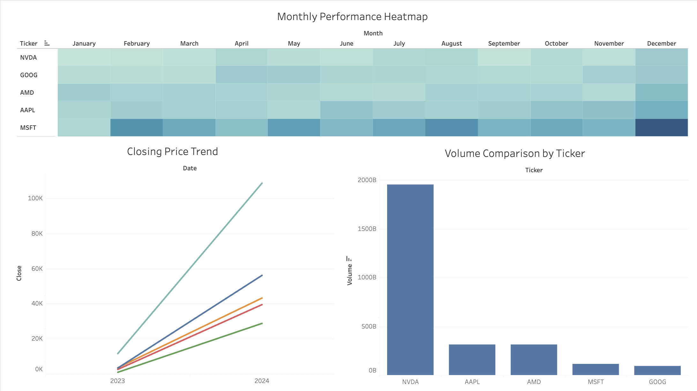

# Stock Market Analysis and Visualization

This repository showcases a project involving data streaming using Kafka, data storage on AWS S3, and visualizations built with Tableau. The data consists of stock market metrics such as open, high, low, close prices, and volumes for popular companies like AAPL, MSFT, NVDA, AMD, and GOOG, collected monthly from January 2024 to January 2025.

## Project Overview

1. **Data Pipeline**:
   - Data was fetched using Polygon.io API.
   - Kafka producers streamed the data to consumers.
   - The consumer saved the data to an AWS S3 bucket.
   - AWS Glue Crawler and Athena were used to query the data.

2. **Visualization**:
   - Tableau was used to build dashboards for data insights.

## Visualizations



### 1. **Monthly Performance Heatmap**
   - **Purpose**: Displays the average closing prices for each ticker across months.
   - **Interpretation**: The intensity of the color indicates performance. Darker shades represent higher closing prices.

### 2. **Closing Price Trend**
   - **Purpose**: Illustrates the trend of closing prices over time for all tickers.
   - **Interpretation**: Helps in identifying long-term growth or decline patterns in stock prices.

### 3. **Volume Comparison by Ticker**
   - **Purpose**: Compares the total trading volume for each ticker across the dataset.
   - **Interpretation**: Highlights which stocks were most actively traded during the period.

## How to Use

1. **Clone the Repository**:
   ```bash
   git clone https://github.com/your-username/stock-market-analysis.git
   ```

2. **Run the Data Pipeline**:
   - Set up Kafka producers and consumers as described in the documentation.
   - Save data to AWS S3.

3. **Visualize Data**:
   - Open the Tableau workbook in Tableau Public or Desktop.
   - Connect to the processed data (Athena query results or CSV).

4. **Explore Insights**:
   - Use the pre-built dashboards to analyze trends and performance.

## Future Scope

- Automate weekly or real-time updates to the dataset.
- Add more tickers or include additional stock metrics.
- Experiment with advanced Tableau features like calculated fields and parameter controls.

## Tools and Technologies

- **Python**: For data processing and Kafka integration.
- **Kafka**: For real-time data streaming.
- **AWS S3**: For data storage.
- **AWS Athena**: For querying the stored data.
- **Tableau**: For building visualizations.

